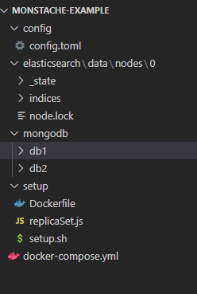

# MongoDB + Elasticsearch + (Docker || JAVA)

## **docker 사용 시**

- ### docker-compose 즉 docker file 작성 필요
- ### mongodb 의 replica 가 필요 (안정화 위해서)
- ### kibana 필요...


 ## 버전 정보

- ### jdk 1.8
- ### elasticsearch: 7.10.1
- ### kibana: 7.10.1

__이렇게 한 이유 : elasticsearch 와 kibana는 항상 버전을 맞춰줘야함. 그리고 7.x.x 버전 부터 보안 관련 부분인 무료 지원을 해준다.__


### docker-compose.yml 꼬라지
```
version: '3'
services:
  elasticsearch:
    restart: always
    image: docker.elastic.co/elasticsearch/elasticsearch:7.10.1
    ports:
      - "9200:9200"  // http api 호출 위한 포트
      - "9300:9300"  // 클라이언트 접속 용 포트
    environment:
      - ES_JAVA_OPTS=-Xms2048m -Xmx2048m
      - discovery.type=single-node
    ulimits: // 메모리락 거는 부분 신경 x 
      memlock:
        soft: -1
        hard: -1
    volumes:
      - ./elasticsearch/data:/usr/share/elasticsearch/data   (로컬):(elasticsearch) 링크
    networks:
      - monstache-network   // monstache-netword 에다가 묶음 네트워크 부분은 아래에 있음

  kibana:
    restart: always
    image: docker.elastic.co/kibana/kibana:7.10.1
    expose:
      - 5601
    ports:
      - 5601:5601
    depends_on: // elasticsearch 랑 연결
      - elasticsearch
    environment:
      - SERVER_PORT=5601
      - SERVER_NAME=kibana.example.org
      - ELASTICSEARCH_HOSTS=http://elasticsearch:9200
    networks:
      - monstache-network

  monstache:
    restart: always
    image: rwynn/monstache:rel6
    command: -f ./config.toml &
    volumes:
      - ./config.toml:/config.toml
    depends_on: // elasticsearch 와 mongodb 1 ,2 레플리카 까지 연결
      - elasticsearch
      - mongodb1
      - mongodb2
    links:
      - elasticsearch
    ports:
      - "8080:8080"
    networks:
      - monstache-network

  mongodb1:
    restart: always
    image: mongo:latest
    container_name: mongo1
    expose:
      - "27017"
    ports:
      - "27018:27017"
    volumes:
      - ./mongodb/db1:/data/db
    command: mongod --replSet rp0
    networks:
      - monstache-network

  mongodb2:
    restart: always
    image: mongo:latest
    container_name: mongo2
    expose:
      - "27017"
    ports:
      - "27019:27017"
    volumes:
      - ./mongodb/db2:/data/db
    command: mongod --replSet rp0
    depends_on:
      - mongodb1
    networks:
      - monstache-network

  mongosetup:
    image: "setup-rspl:latest"
    depends_on:
      - mongodb1
    networks:
      - monstache-network

networks:
  monstache-network: //default 이면 기본 network 설정 해주고 묶어줌.
```


